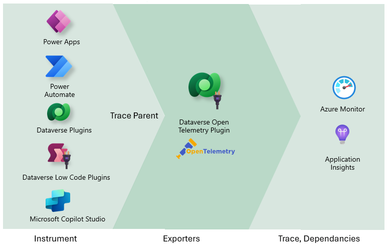
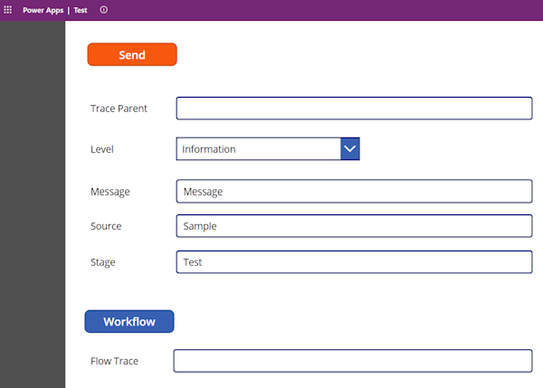
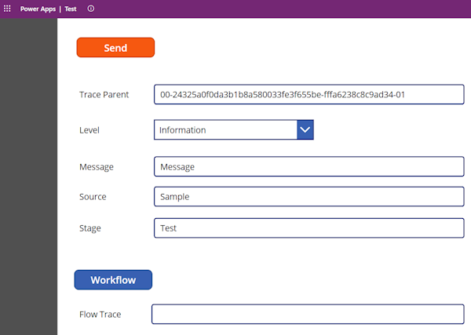
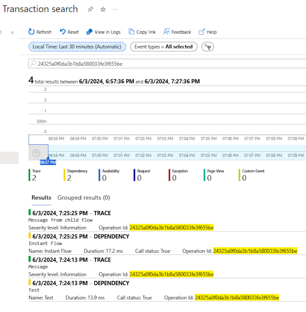
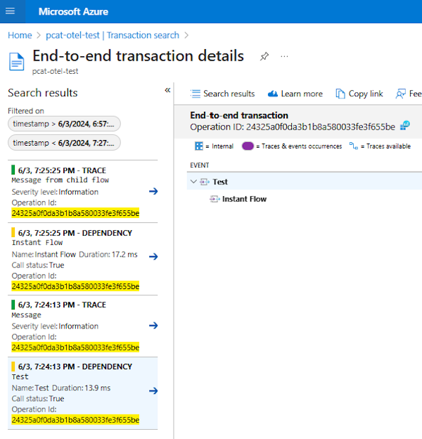

# Dataverse Open Telemetry sample

This project contains an example of Dataverse plugin integration with [Open Telemetry](https://opentelemetry.io/). OpenTelemetry is a collection of APIs, SDKs, and tools. Use it to instrument, generate, collect, and export telemetry data (metrics, logs, and traces) to help you analyze your software’s performance and behavior.

## Why Open Telemetry?

Some reasons to consider making use of Open Telemetry model for observability of Power Platform components:

1. Out of the box telemetry exporters exist for Azure Monitor and Application Insights

2. The ability to make use of available [.NET Exporters](https://opentelemetry.io/docs/languages/net/exporters/) to integrate with a wide range of observability platforms

3. The ability to extend Open Telemetry with your own exporter using [Extending the OpenTelemetry .NET SDK](https://github.com/open-telemetry/opentelemetry-dotnet/blob/main/docs/trace/extending-the-sdk/README.md)

4. Make use of [Context propagation](https://opentelemetry.io/docs/concepts/context-propagation/) to allow correlation across multiple Power Platform components and other systems

## Goals

The design goals of this sample are to:

1. Demonstrate how the Dataverse plugin can be used to implement distributed tracing across Power Platform components

2. Show how the out of the box Azure Monitor Trace Exporter can use used to generate trace and dependency data

3. Show how the plugin can be used across Power Apps, Power Automate and Dataverse to provide end to end to traceability.

4. Use of Power Platform Environment variables to configure Connection parameters.

5. Get feedback on this approach and determine what Open Telemetry features should be part of the Power Platform.

## Comparison

Using Dataverse plugins and Open Telemetry is just one way of obtaining operations insights on the execution of Power Platform components. Other approaches to consider of adding observability could include:

| Component | Notes |
|-----------|-------|
| [Analyze system-generated logs using Application Insights](https://learn.microsoft.com/en-us/power-apps/maker/canvas-apps/application-insights) | You can connect your canvas apps to Application Insights |
| Power Apps Canvas and Custom Pages | Make use of [Trace()](https://learn.microsoft.com/power-platform/power-fx/reference/function-trace) function |
| Power Pages | Make use of [Content Snippets](https://learn.microsoft.com/power-pages/configure/customize-content-snippets) for the [JavaScript code](https://learn.microsoft.com/azure/azure-monitor/app/javascript-sdk?tabs=javascriptwebsdkloaderscript#add-the-javascript-code)
| [Application Insights with Dataverse](https://learn.microsoft.com/en-us/power-platform/admin/telemetry-events-dataverse?source=recommendations) | Provides Requests, exceptions and dependencies. This appraoch covers Model Driven Applications and wider Dataverse insights.
| [Telemetry within your plug-in code](https://learn.microsoft.com/power-platform/admin/telemetry-events-dataverse?source=recommendations#telemetry-within-your-plug-in-code) | Use if ILogger interface to write to application insights from a Dataverse Plugin |
| [Application Insights with Power Automate](https://learn.microsoft.com/power-platform/admin/app-insights-cloud-flow) | Provides Requests and dependencies for monitoring of cloud flow executions, trigger and actions |
| [Export data to Application Insights](https://learn.microsoft.com/en-us/power-platform/admin/set-up-export-application-insights) | To configure the Environment Dataverse and Power Automate data to export to a subscription in the same tenant as Power Platform |

## Future

The following area could be expanded on this sample to demonstrate other scenarios. This could include:

1. Implement a Dataverse Exporter using the [Extending the sdk](https://github.com/open-telemetry/opentelemetry-dotnet/tree/main/docs/trace/extending-the-sdk#exporter) guidance to shows how monitoring data could be stored in Dataverse or other locations.

2. Use of Power Platform Environment variables which exporters should be used. For example Azure Monitor, OLTP exporter or Dataverse Exporter.

3. Demonstrate how to use customer managed key (CMK) to encrypt telemetry.

4. Demonstrate how to make use of [Use managed identities for Dataverse plug-ins](https://learn.microsoft.com/en-us/power-platform/release-plan/2024wave1/power-platform-governance-administration/use-managed-identities-dataverse-plug-ins) to authenticate with Exporters.

## Architecture

Visualizing the end to end process could be shown in the following diagram

Power Platform components like Power Apps, Power Automate, Dataverse Plugins and Microsoft Co-Pilot studio can be instrumented by calling the Dataverse Plugin.

The plugin queries the Dataverse Environment for the connection string. The plugin then starts a unique operation will call the Dataverse Plugin which will return a unique Trace Parent consisting of a Trace Id and Span Id. Following calls pass in the initial Trace Parent, which will continue the same operation id and generate a new span id.

The Dataverse Plugin uses the .Net NuGet Open Telemetry provider to use the default Azure Monitor Exporter to generate trace and dependency records in Application Insights.

## Trace Parent Relationship

The following table demonstrates the Trace Parent where the same operation id persists and each component has a unique id appended which can ue sued to regenerate parent child relationship between components.

| Component      | Trace Parent (In)                                    | Trace Parent Out                                     | Message |
|----------------|------------------------------------------------------|------------------------------------------------------|---------|
| Power App      |                                                      | 00-2d708f92ccca7d80ca0ba94bfc97f32a-df0cb752131c1561 | Application Started |
| Power App      | 00-2d708f92ccca7d80ca0ba94bfc97f32a-df0cb752131c1561 | 00-2d708f92ccca7d80ca0ba94bfc97f32a-015c4c32ecb15800 | Button Clicked |
| Power Automate | 00-2d708f92ccca7d80ca0ba94bfc97f32a-015c4c32ecb15800 | 00-2d708f92ccca7d80ca0ba94bfc97f32a-4022c655c6549306 | Flow started |
| Power Automate | 00-2d708f92ccca7d80ca0ba94bfc97f32a-4022c655c6549306 | 00-2d708f92ccca7d80ca0ba94bfc97f32a-c7d2d09caadb0463 | Child Flow started |

## Example

Demonstrating an example of this relationships with a Power App that calls a Power Automate cloud flow and the resulting Application Insights, traces and dependency.

The test Power App has no Trace Parent when loaded. The user can then select the Send button. This action will call the Dataverse plugin. 

The Trace Parent updated as a result of the first span in the process.

After the Power Automate Cloud flow it generates a new span id for the cloud flow action as part of the same operation id

The operation id that relates all these steps can be queries in Application Insights Transaction search

And the details and relationship between the components be visualized.
