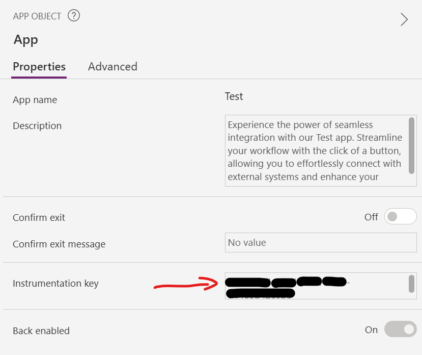
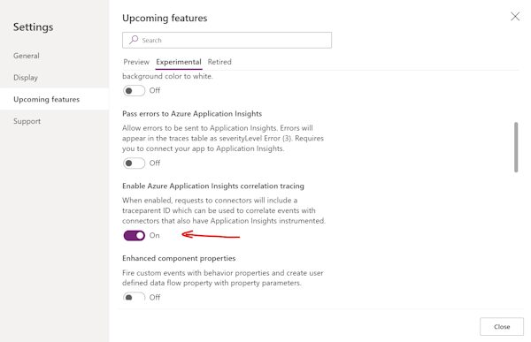
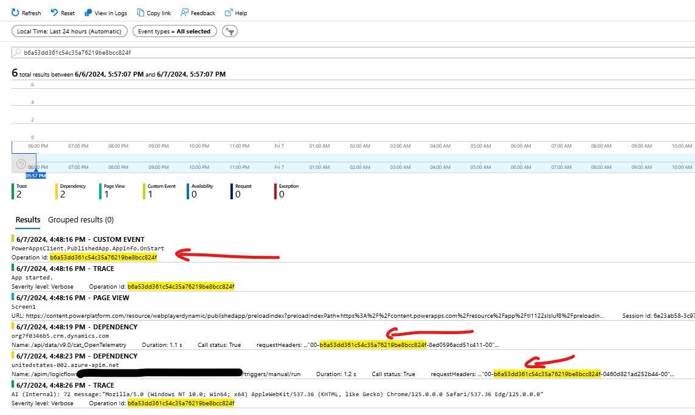
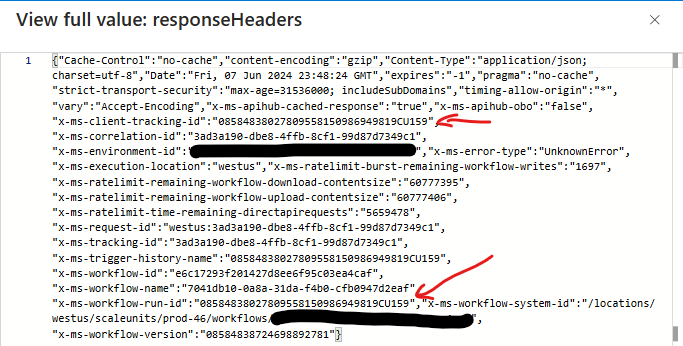

# Overview

When looking at the out of the box features for Power Platform that can be join end to end telemetry.

| Component  | Setting               | Description |
|------------|-----------------------|-------------|
| Power Apps | Instrumentation Key  | Provide the ability to collect Power App data for an application |
| Power Apps | Enable Azure Application Insights correlation tracing | Provide the ability to generate W3C traceparent in request header of connections |
| Power Automate | Power Platform Admin Center - App Insights Export | Enable Environment Export of Data Export to Application Insights |
| Application Insights | Transaction Search | Search for Power Apps operation id
| Application Insights | Log query | Join data to retrieve Power Apps and Power Automate |

## Relationship to Open Telemetry

This sample demonstrates how to make use of distributed tracing between a Power App Canvas application and a Power Automate cloud flow using Application Insights.

This process enables observability where the canvas application starts the process. There may be cases where the Dateverse Open Telemetry plugin could be relevant to extend this sample by:

- Providing the ability to export to telemetry to other observability solutions in addition or as an alternative to Application Insights

- Providing for long running observability across multiple Power Platform components. For example providing end to end observability were the trace parent can be persisted across the following stages
   - Process starts with a Microsoft Copilot Studio
   - Calls to a Power Automate Cloud Flow.
   - Data stored in a work queue
   - An internal user is required to review the process and uses a Power App

- Allowing for operations that do not start with a Power App but starts with a Power Automate flow and passes the traceparent as a parameter to the Power App.

- Allowing the Traceparent to be persisted in Dataverse to track the overall end to end process.

## Example

Lets walk through an example of this process assuming an Azure Application Insights instance has been created

## Power Apps Instrumentation Key

In the App settings set the Instrumentation Key from the settings from Application Insights setting



## Enable Azure Application Insights correlation tracing

Update the application settings to enable correlation tracking

1. Open canvas application settings

2. Select **Upcoming features**

3. Select **Experimental**

4. Turn on the correlation tracking option



## Power Platform Admin Center - App Insights Export

Enable Application Insights integration with the Environment where the Power Automate Cloud by following steps of [Export data to Application Insights](https://learn.microsoft.com/en-us/power-platform/admin/set-up-export-application-insights)

## Transaction Search

After a successful execution of test application that uses a Power App and a Power Automate Cloud flow using the operation id started by the Power App. This example highlights from key points:

- A unique operation id for each session of the Power App
- A unique W3C Trace Parent is passes to each connector. In this example the call to the Dataverse Plugin and the Power Automate Cloud flow.
- The traceparent contains the operation id of the parent Power App joined with unique id per call to connector
- Application Insights dependency records are related for each connector call



The response headers of the Power Automate cloud flow dependency includes a unique id of the instance of the Power Automate Cloud flow run



## Log Search

Using the two ids for the operation id and client tracking id the results can be joined together in a kql query

```kql
union isfuzzy=true
    availabilityResults,
    requests,
    exceptions,
    pageViews,
    traces,
    customEvents,
    dependencies
| where timestamp > datetime("2024-06-07T01:45:20.253Z") and timestamp < datetime("2024-06-08T01:45:20.253Z")
| where (* has "b6a53dd361c54c35a76219be8bcc824f") or (* has "08584838027809558150986949819CU159")
| order by timestamp asc
```
